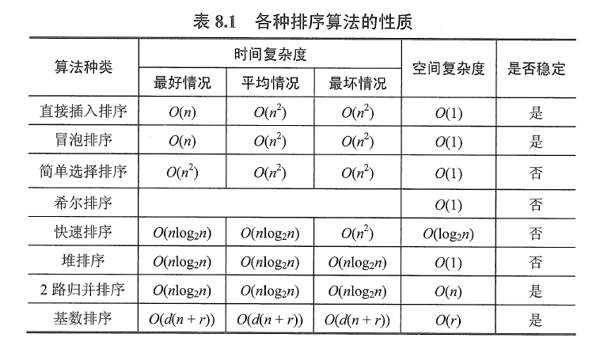

# 数据结构与算法

1. 数据结构

    **数据结构**是**带结构**的数据元素的集合。（结构是指数据元素之间的关系）

    数据结构包含：

    - 逻辑结构：数据之间的逻辑关系
    - 物理结构（存储结构）：数据元素及其关系在计算机内部的表示
    - 数据的运算和实现
    
2. 逻辑结构
    - 线性结构：有且只有一个开始和一个终端结点，并且所有结点最多只有一个直接前驱和一个直接后继。
    - 非线性结构：一个结点可能有多个直接前驱和直接后继；具体有集合结构，树形结构，图状结构。
    
3. 存储结构

    顺序存储结构：用一组**连续**的存储单元依次存储数据元素，数据元素之间的逻辑关系由元素的**存储位置**来表示。优点：随机存取；缺点：只能使用相邻的一整块存储单元，可能产生较多外部水片。

    链式存储结构：用一组任意的存储单元存储数据元素，数据元素之间的逻辑关系用**指针**来表示。优点：不会产生碎片现象，能充分利用所有存储单元；缺点：每个元素因指针而占用额外的存储空间，只能实现顺序存储。

    索引存储结构：在存储元素信息的同时，还建立附加的索引表。优点：检索速度快；缺点：索引表占用额外的存储空间，增加和删除数据会修改索引表，耗时较多。

    散列存储结构：根据元素的关键字直接计算出该元素的存储地址。优点：检索、增加、删除结点操作很快；缺点：可能出现冲突，解决冲突会增加时间和空间开销。

4. 数据类型

    数据类型是一组性质相同的值的集合，以及定义于这个集合上的一组操作的总称。

    在C语言中，声明了某个数据类型的变量，意味着规定了该变量的存储空间大小，以及能够执行的运算。

5. 抽象数据类型（**A**bstract **D**ata **T**ype, ADT）三要素<D, S, P>
    - 数据对象
    - 数据对象的关系集
    - 数据对象的操作集
    
6. 算法

    算法是对特定问题求解步骤的一种描述，它是指令的有限序列，其中每条指令表示一个或多个操作。此外算法具有如下5个重要特性：

    - 有穷性：一个算法必须总在执行有穷不之后结束，且每一步都可在有穷时间内完成；
    - 确定性：算法中每条指令必须有确切的含义，对于相同的输入只得得到相同的输出；
    - 可行性：算法中描述的操作都可以通过已经实现的基本运算执行有限次来实现；
    - 输入
    - 输出
    
7. **算法效率的度量**
    - 时间复杂度

        时间复杂度是指算法中基本运算的执行次数的数量级。

    - 空间复杂度

        空间复杂度是指算法运行过程中所使用的**辅助空间**的数量级；

        例如O(1)表示的是该算法最多只使用常数个额外的辅助空间，而不是不使用辅助空间。

    - O，$\Omega$,  $\Theta$ 的含义
    
8. 递归
    1. 递归是指函数的定义中直接或间接调用自身的一类描述问题和解决问题的方法；
    2. 递归有一个明确的递归结束条件，称为递归出口。
    
9. 程序

    程序是某种程序设计语言对算法的实现。简单理解为：程序 = 数据结构 + 算法

10. 线性表

    线性表是具有**相同数据类型**的n(n>0)个数据元素的**有限**序列，表示为（a1,a2, ..., an）.具有的逻辑特征：

    - 非空的线性表有且只有一个开始结点，它没有直接qi
    - 非空的线性表有且只有一个结束结点，它没有直接后继，有且只有一个直接前驱；
    - 其余的内部结点都有且只有一个直接前驱和直接后继；
    
11. 顺序表 vs 链表

    顺序表既可以顺序访问，也可以随机访问；链表只能顺序访问。

    顺序表的元素，逻辑上相邻的元素，对应的物理存储位置也相邻；链表则不一定。

    顺序表插入删除一般需要移动元素的位置，效率较低； 链表插入删除只需要修改相关结点的指针域。

12. 静态链表：借助数组来描述线性表的链式存储结构。

13. 栈 ：后进先出LIFO

14. 队列：先进先出FIFO

15. 循环队列：

    队列直接简单地顺序存储时，会因为不断地进队出队，而可能造成数组中依旧有空位置却依然“溢出”的现象（自行脑补）。因此可以设计成循环队列来解决这个缺陷。

    循环队列的一种设计思路：牺牲一个单元来区分队空还队满，入队时少用一个队列单元。此时：

    队空：front == rear

    队满：(rear + 1) % maxSize == front

16. 双端队列：可以在队列两端进行入队和出队操作；

    对应STL容器的deque，其内部实现是将动态地将多段连续空间用指针链接起来。

17. 树

    定义（递归定义）：树Tree是n个结点的有限集。若n=0，称为空树；若n>0，（1）有且只有一个特定的称为根的结点；（2）其他结点可以分为m个互不相交的有限集，其中每个集合又是一棵树，称为子树。

    特点：树的根结点没有前驱，除根结点外的所有结点有且只有一个前驱；树的所有结点可以有零个或多个后继；

    概念：双亲，祖先，子孙；根节点，分支结点，叶结点，结点的度（结点拥有的子树数），树的度（结点的度的最大值）

    森林：互不相交的树的集合。

18. 二叉树

    特点：每个结点至多只有两颗子树，子树有左右之分，不能颠倒次序。

    满二叉树，完全二叉树，二叉排序树，平衡二叉树（任一结点的左子树和右子树的深度之差不超过1）

    先序遍历，后序遍历，中序遍历，层次遍历；

19. 线索二叉树

    如果某个结点的左孩子为空，则将空的左孩子指针域改为指向其前驱；

    如果某个结点的右孩子为空，则将空的右孩子指针域改为指向其后继；这种改变指向的指针称为”线索“。

    添加了线索的二叉树称为线索二叉树。

20. 树和二叉树之间的转换，森林和二叉树的转换。

21. **哈夫曼树的性质和特点？**

    结点的带权路径长度：从根结点到该结点的**路径长度**与该结点的**权重**的乘积。

    树的带权路径长度：树中所有**叶子**结点的带权路径长度之和。$WPL = \sum_{k=1}^nw_kl_k$

    哈夫曼树是指**带权路径长度最短**的树。构造的策略：贪心算法。

    应用：哈弗曼编码。将编码设计成长度不等的二进制编码，目标是让待传输的字符串中出现较多次的字符采用尽可能短的编码，则转换的二进制字符串便减少，哈夫曼编码是最优的前缀码。

    **前缀编码**：任一字符的编码都不是其他字符的编码的前缀。（可以联系计网中的子网划分）

    哈夫曼树的特点：

    - 没有度为1的结点；
    - n个叶子结点的哈夫曼树共有2n-1个结点；
    - 哈夫曼树的任意非叶节点的左右子树交换后仍是哈夫曼树；
    - 对同一组权值{w1 ,w2 , …… , wn}，存在不同构的两棵哈夫曼树
    
22. 图

    定义：由顶点集V和边集E组成，G = (V, E)。

    有向图，无向图，简单图，多重图，完全图，子图。

    生成子图要求子图的顶点集和原图的顶点集相同。

    连通分量：无向图的**极大连通子图**称为连通分量。

    连通图的生成树是包含图中全部顶点的一个**极小连通子图**。

23. 图的存储方式

    邻接矩阵法；邻接表法；

    有向图：十字链表法；（对于某一顶点，既容易找到以之为尾的弧，又容易找到以之为头的弧）

    无向图：邻接多重表；（无向图的邻接表每条边要存储两次，而邻接多重表只保存一次，对于访问所有的边，或者要删除某一条边时操作更加方便。）

24. 图的遍历

    BFS：由于辅助队列，空间复杂度$O(|V|)$。邻接表存储时时间复杂度$O(|V|+|E|)$，邻接矩阵存储时间复杂度为$O(|V|^2)$

    DFS：由于递归工作栈，空间复杂度$O(|V|)$。邻接表存储时时间复杂度$O(|V|+|E|)$，邻接矩阵存储时间复杂度为$O(|V|^2)$

25. 最小生成树的算法

    Prim算法：时间复杂度为$O(|V|^2)$，因为不依赖于|E|，所以适用于求解**边稠密**的图。

    Kruskal算法：采用优先队列实现时，时间复杂度为$O(|E|\log |E|)$，适用于求**边稀疏而顶点较多**的图。

26. 最短路径

    单源最短路径：Dijkstra算法；

    每对顶点间的最短路径：Floyd算法；

27. 拓扑排序

28. B树或者为空树，或者为满足如下特性的m叉树：
    1. 树中每个结点至多有m棵子树，即至多含有m-1个关键字；
    2. 若根结点不是终端结点，则至少有两棵子树；
    3. 除根结点外的所有非叶结点至少为m/2棵子树（向上取整）;
    4. 每个叶子结点具有相同的深度，即树的高度h;
    
29. B树要插入一个节点，应该如何保持平衡？

    插入后关键字小于m，则结束；

    插入后关键字等于m，则分裂为两部分，原来中间的结点插入到父结点中。继续判断父节点是否需要进行分裂操作。

30. 与B树相比，B+树有什么特点？
    - 有k个子结点的结点具有k个关键码；
    - 非叶结点仅具有索引作用，跟记录相关的信息放在叶子结点中；
    - 同一个关键字可以在不同的结点中出现；
    - 树的所有叶结点构成一个有序链表，因此也支持从最小关键字开始的顺序查找；

    因为B+树的非叶结点只保存索引信息，所以结点大小相同时B+树的每个非叶结点可以表示更多的记录。因此处理相同的数据时，B+树比B树高度更低，磁盘访问次数更少，所以查找效率比B树更高。

31. 什么是哈希冲突？如何解决。

    哈希函数把两个或两个以上的不同关键字key映射到同一地址的现象称为冲突；

    解决冲突的方法：

    - 开放定址法：$hash_i=(hash(key)+d_i) \mod m, i=1,2,...,k(k \le m-1)$，$hash(key)$为哈希函数，$m$为哈希表长度，$d_i$为增量序列，$i$为已发生冲突的次数。
        - 线性探测法：逐一探测存放的表，直到找到一个空单元把地址存放进去，即$d_i=1,2,3,...,(m-1)$
        - 平方探测法：发生冲突时按照序列$d_i=1^2,-1^2,2^2,-2^2,...,k^2,-k^2(k\le m/2)$选取间隔的单元位置，直到找到空单元把地址放进去。
    - 再散列法：通过第一个哈希函数$hash_1(key)$得到的地址冲突时，选用第二个哈希函数$hash_2(key)$计算地址。
    - 链地址法：将所有哈希地址为i的元素构成一个称为同义词链的单链表。

    装填因子：表中记录数/ 散列表的长度；直观来看，装填因子越大，发生冲突的可能性越大。

32. 算法的稳定性：待排序表中两个关键字相同的元素，在经过排序之后的相对位置保持不变的排序算法称为稳定的。

33. 外部排序：在排序期间元素无法全部同时存在内存中，需要在排序过程中不断地在内存、外存之间进行移动的排序。

34. 介绍一下你学过哪些排序算法？（可以自己回忆一下每种排序算法的原理，想想在何种场景下适合使用）
    - 直接插入排序
    - 二分插入排序
    - 希尔排序
    - 冒泡排序
    - 快速排序
    - 简单选择排序
    - 堆排序
    - 归并排序
    - 基数排序
    
35. 说说一两种排序算法的优劣？

    王道的数据结构参考书P347页的小结讲得很不错，可以参考。

    附上一张总结的表格：

    

36. 快速排序和归并排序的平均时间复杂度都是$O(n \log n)$，为什么在应用中更多采用快速排序而不是归并排序？

    算法除了考虑时间复杂度之外，还要考虑一个常量。例如有两个算法时间复杂度都是$O(n)$，但可能算法1实际是10n，而算法2实际是100n，所以相比之下算法1的速度更快。

    快速排序最坏时间复杂度为$O(n^2)$，但是退化到$O(n^2)$的概率很低，平均的表现为$O(n \log n)$。快速排序的常量比归并排序小，因此虽然平均时间复杂度相同，但实际应用中快速排序更快一些。

    另一方面，归并排序的空间复杂度为$O(n)$，而快速排序平均空间复杂度为$O(\log n)$相对较低。

    当然归并排序也有自己的优点。归并排序是稳定的，适用于外部排序的场景，且在链表上排序效果很好（快排也可以在链表上实现，但是由于链表无法随机访问，快排无法随机选择pivot，因此数据基本有序或基本逆序时性能表现差）。